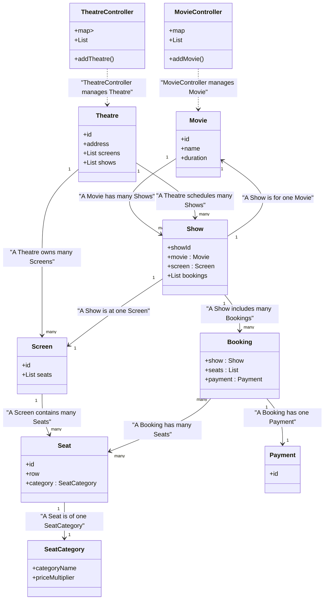

## Movie Ticket Booking System – UML Diagram, Objectives & Requirement Classification

---

### **Objectives**

- **Organize movie screenings across multiple theatres/screens**
- **Efficiently manage seat selection and categories**
- **Allow users to book tickets for specific shows and seats**
- **Ensure secure payment for bookings**
- **Enable easy addition/removal of movies, theatres, shows, and screens via controllers**

---

### **Requirement Classifications**

1. **Movie Listing & Scheduling**
   - System should support adding, removing, and listing movies.
   - Each movie can have multiple shows across different theatres/screens.

2. **Theatre & Screen Management**
   - Theatres may own multiple screens and schedule many shows.
   - Each screen contains multiple seats; seats have defined categories (Silver/Gold/Platinum).

3. **Show Management**
   - Shows represent a movie in a theatre at a specified time.
   - Each show is linked to a movie and a specific screen.

4. **Seat Booking**
   - Users can select seats for a specific show.
   - Bookings may include multiple seats, which are categorized/priced.

5. **Payment Integration**
   - Each booking must have a secure payment transaction.
   - Payments are tracked separately with their own statuses.

6. **Extensibility & Maintainability**
   - Controllers allow easy management (CRUD) of movies, theatres, shows, and screens.

---

## **UML Diagram (with Clear Relationships)**

---

**How to Explain to Interviewer:**
- **Introduce Objectives**: "The system is designed to manage movies, theatres/screens, shows, seat selection, bookings, and payments in a scalable way."
- **Map Requirements**: "Movies are scheduled into shows that happen at specific screens in theatres. Each show supports seat booking, where seats have categories and prices. Every booking is associated with a secure payment."
- **Clarify Relationships**: "E.g., a movie may have many shows, each show occurs on a specific screen in a theatre, and bookings link shows with seat and payment info. Controllers handle adding/removing core objects for easy maintenance."

---

**This formatting helps you present the UML, objectives, and requirements clearly and confidently to an interviewer.**
